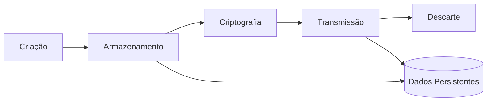
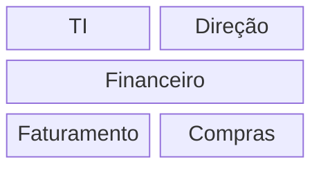

# Politica de Segurança de informação

Toda empresa deve se adquar ao regras e padroes,devendo ser adequadamente utilizado e protegido contra **riscos**, **ameaças**, **violações**, **acessos não autorizados** e **danos**.
É imprescindível, portanto, a adoção de condutas, normas e
procedimentos padronizados que tenham como objetivo garantir a proteção dos três
aspectos básicos da segurança da informação:

- confidencialidade.
- integridade.
- disponibilidade.

Pois tem por objetivo possibilitar o gerenciamento
da segurança em uma organização, estabelecendo regras e padrões para proteção
da informação.
A política possibilita manter a confidencialidade, garantir que a informação
não seja alterada ou perdida e permitir que a informação esteja disponível quando for necessário.

## Politicas aplicadas

[Política Nacional de Segurança da Informação](https://www.in.gov.br/materia/-/asset_publisher/Kujrw0TZC2Mb/content/id/56970098/do1-2018-12-27-decreto-n-9-637-de-26-de-dezembro-de-2018-56969938)

[Marco Civil da Internet](https://www.planalto.gov.br/ccivil_03/_ato2011-2014/2014/lei/l12965.htm)

## Dispositivos movel e Teeltrabalho

### Dispositivos móveis ou uquipamentos eletronicos

**Anexo A.6.2.1.**

É estritamente proibido o uso de dispositivos móveis de uso pessoal em todos os setores e locais da empresa. Somente aparelhos fornecidos pelo empregador estão autorizados para uso durante o expediente.

Somente serão tolerados _Dispositivos móveis_ , _Notebooks_ ou _Dispositivos Eletronicos_ pessoais em locais indicados:

- Portaria
- Refeitorio
- Sala de Espera
- Área de descompressão
- Área Indicadas com placas de sinalização

### Teletrabalho ou Trabalho Remoto

**Anexo A.6.2.2.**

Todo e qualquer trabalho remoto deve ser comunicado com um aviso prévio de 1 semana para que sejam implementadas as medidas de segurança necessárias para controle de acesso à rede de forma remota.

O colaborador terá acesso a um dispositivo fornecido pelo empregador, um Notebook Dell Nitro 5, com código de identificação específico, estando acordado entre as partes o seguinte:

- É proibida a instalação ou execução de programas ou aplicações que não tenham sido fornecidos pelo empregador.
- O uso de proxy ou VPNs que não sejam fornecidos pela empresa é estritamente proibido.
- A destruição ou adulteração do sistema operacional do dispositivo será considerada uma conduta antiética, sujeita a penalidades administrativas.
- Não será aceito o uso de dispositivos incompatíveis com o número de série fornecido ou com hardware diferente do especificado.
- O colaborador tem a obrigação de seguir as normas de Segurança da Informação, mesmo durante o trabalho remoto.
- A devolução do aparelho deve ser feita no prazo acordado

## Adequação ou elaboração de cláusulas contratuais / informativos para RH

### A.7.1.2 Termos e condiçoes de contratação

Durante as etapas de recrutamento, seleção e admissão do novo colaborador,podem ser solicitados, informações básicas do profissional, como nome completo, endereço, número de telefone, e-mail, data de nascimento, estado civil, nacionalidade, número de identidade e CPF.

Possível incluir informações relacionadas à formação acadêmica do candidato, experiência profissional, habilidades, referências, salário anterior e expectativas salariais.

_Sem que isso signifique qualquer descumprimento à LGPD._

No entanto, é importante lembrar que a coleta de dados sensíveis, como etnia, religião, orientação sexual, entre outras, é proibida,sem o consentimento co titular, pela lei, a menos que haja uma justificativa legal ou consentimento explicito.

LGPD Artigo 11,Artigo 12,Artigo 13

**Artigo 11**

    Caput: O tratamento de dados pessoais sensíveis somente pode ocorrer nas seguintes hipóteses:

I - Quando o titular ou seu responsável legal consentir, de forma específica e destacada, para finalidades específicas.

II - Sem fornecimento de consentimento do titular, nas hipóteses em que for indispensável para:

- cumprimento de obrigação legal ou regulatória pelo controlador;

- tratamento e uso compartilhado de dados necessários à execução, pela administração pública, de políticas públicas previstas em leis ou regulamentos;

- realização de estudos por órgão de pesquisa, garantida, sempre que possível, a anonimização dos dados pessoais sensíveis;

- exercício regular de direitos, inclusive em contrato e em processo judicial, administrativo e arbitral;
- proteção da vida ou da incolumidade física do titular ou de terceiro;

- tutela da saúde, exclusivamente, em procedimento realizado por profissionais de saúde, serviços de saúde ou autoridade sanitária;

- garantia da prevenção à fraude e à segurança do titular, nos processos de identificação e autenticação de cadastro em sistemas eletrônicos.

**Artigo 12**

    Caput: Nos casos em que o tratamento de dados pessoais sensíveis se der sem o consentimento do titular, será necessário, sempre que possível, a anonimização dos dados pessoais sensíveis.

 

### A.7.2.2 Trinamentos

Todos os novos colaboradores e contratados devem completar um treinamento de integração em segurança da informação antes de obter acesso aos sistemas de informação da empresa.

O treinamento deve cobrir:

- Políticas de segurança da informação
- Procedimentos de segurança
- Boas práticas de segurança
- Responsabilidades do colaborador

Treinamentos regulares devem ser realizados para todos os colaboradores, com frequência mínima anual.

Os treinamentos contínuos devem incluir:

- Atualizações de políticas e procedimentos
- Novas ameaças e vulnerabilidades
- Simulações de incidentes de segurança
- Revisões de boas práticas

Colaboradores em funções críticas ou com acesso a informações sensíveis devem receber treinamento adicional específico para suas responsabilidades.
Exemplos incluem:

- Administração de sistemas e rede ou equipe de TI
- Recursos Humanos(RH)

Todos os treinamentos devem incluir uma avaliação para medir a compreensão e a retenção dos conhecimentos.

Resultados das avaliações devem ser monitorados para identificar áreas de melhoria e ajustar os programas de treinamento conforme necessário.

Relatórios de participação e desempenho nos treinamentos devem ser mantidos e revisados periodicamente.

### Enserramento ou mudança na contratação ou acesso

**A.7.3.1**

O Departamento de Recursos Humanos (RH) terá acesso restrito ao sistema para exclusão de Colaboradores de Baixo Privilégio.

O cancelamento de acesso será requisitado diretamente ao RH, e após a confirmação do cancelamento, o prazo para efetivar a exclusão de acesso do colaborador no sistema será de **1 hora**.

O aumento de privilégios de colaboradores será realizado pela equipe de TI, mediante autorização do Departamento de Recursos Humanos (RH), conforme acordado entre ambas as partes. Um exemplo do procedimento:

- Identificação (ID) ou Nome Completo do funcionário.
- Setor em que trabalha.
- Novo tipo de privilégio ou área a frequentar.

_Após a mitigação pelo setor de TI, o privilégio será aplicado. O acesso pode ser negado caso haja uma indevida atribuição de tarefas ou área/setor incompatível com o quadrante do funcionário._

## Porteção e controle de Ativos

**A.8.1.1**

Todos os ativos de informação devem ser identificados e registrados no inventário de ativos.

O inventário deve incluir, mas não se limitar a:

- Hardware (servidores, computadores, dispositivos móveis)
- Software (sistemas operacionais, aplicativos, licenças)
- Dados e informações (bancos de dados, arquivos, documentos)
- Dispositivos de armazenamento (discos rígidos, pen drives)
- Recursos de rede (roteadores, switches, firewalls)
- Outros recursos (mídias de backup, documentos impressos)

Cada ativo no inventário deve incluir informações detalhadas, como:

- Descrição do ativo
- Proprietário do ativo
- Localização física ou lógica
- Valor ou importância do ativo
- Data de aquisição
- Estado ou condição atual
- Medidas de segurança aplicáveis
- Data da última revisão ou atualização do inventário

| Descrição do ativo                  | Proprietário do ativo | Localização física ou lógica   | Valor ou importância do ativo | Data de aquisição | Estado ou condição atual | Medidas de segurança aplicáveis                                         | Data da última revisão ou atualização do inventário |
| ----------------------------------- | --------------------- | ------------------------------ | ----------------------------- | ----------------- | ------------------------ | ----------------------------------------------------------------------- | --------------------------------------------------- |
| Servidor de Banco de Dados Primário | João Silva            | Data Center, Rack 3, Unidade 5 | Alto                          | 15/02/2021        | Em operação              | Controle de acesso biométrico, criptografia de dados, firewall dedicado | 01/03/2024                                          |

O inventário de ativos deve ser atualizado regularmente para refletir adições, mudanças ou descomissionamentos de ativos e Revisões periódicas (pelo menos anualmente) devem ser realizadas para garantir a precisão e a completude do inventário.

Medidas de segurança apropriadas devem ser implementadas para proteger cada ativo, conforme sua classificação e valor exemplos de medidas de proteção incluem controle de acesso, criptografia, backups regulares e monitoramento de segurança.

Todos os colaboradores devem receber treinamento sobre a importância do inventário de ativos e suas responsabilidades na manutenção e proteção dos ativos e sessões de conscientização devem ser realizadas regularmente para manter o conhecimento atualizado.

**A.8.1.2**

Cada ativo deve ter um proprietário designado,da equipe de TI, que será responsávelpela gestão e proteção do ativo.

- Assegurar que o ativo seja adequadamente registrado no inventário.
- Garantir que as medidas de segurança apropriadas sejam implementadas e mantidas.
- Monitorar o uso do ativo e relatar qualquer incidente de segurança.

**A.8.1.3**

Os ativos de informação devem ser utilizados de maneira responsável e ética, exclusivamente para fins relacionados às atividades da empresa.

Os colaboradores e contratados devem seguir as diretrizes de uso aceitável, que incluem:

- Uso Autorizado:

  - Utilizar os ativos apenas para tarefas autorizadas e relacionadas ao trabalho.
    Proteção dos Ativos: Não compartilhar informações sensíveis com pessoas não autorizadas e proteger os ativos contra acesso não autorizado.

- Conformidade com Leis e Políticas:
  - Cumprir todas as leis aplicáveis, regulamentações e políticas internas da empresa.
- Respeito aos Direitos de Propriedade Intelectual:

  - Não copiar ou distribuir software ou outras propriedades intelectuais sem permissão adequada.
    Uso da Internet e E-mail: Usar a internet e o e-mail corporativo de maneira apropriada, evitando atividades ilegais ou inadequadas.

- Consequências do Uso Indevido:
  - O uso inadequado dos ativos pode resultar em medidas disciplinares, que podem incluir advertências, suspensão ou demissão, conforme a gravidade da violação.

## Rotulos e tratamento

**A.8.2**

**Categorias de Classificação:**

Toda informação deve ser rotulada de acordo com a sua classificação.
Rótulos devem ser claramente visíveis e legíveis, e aplicados tanto a informações físicas quanto digitais.

- Confidencial:
  - Informação cujo acesso é restrito e cuja divulgação não autorizada pode causar danos significativos à empresa.
- Interno:
  - Informação que é destinada ao uso interno da empresa e cuja divulgação não autorizada pode causar danos moderados.
- Público:
  - Informação que pode ser divulgada sem restrições e cujo acesso é irrestrito.

_Toda informação deve ser rotulada de acordo com a sua classificação._
_Rótulos devem ser claramente visíveis e legíveis, e aplicados tanto a informações físicas quanto digitais._

**Tratamento da Informação.**

- Confidencial:
  - Deve ser acessada somente por pessoal autorizado, armazenada em locais seguros, e transmitida usando métodos criptografados.
- Interno:
  - Deve ser acessada por funcionários e parceiros conforme necessário, armazenada em áreas controladas, e transmitida usando métodos seguros.
- Público:
  - Pode ser acessada e distribuída livremente, mas deve ser protegida contra alterações não autorizadas.

**Ciclo de Vida da Informação.**

Garantir que a informação seja corretamente classificada e rotulada no momento da criação.

**Criação**: Garantir que a informação seja corretamente classificada e rotulada no momento da criação.

**Armazenamento**: Proteger a informação conforme sua classificação, utilizando controles de acesso apropriados.

**Transmissão**: Utilizar métodos seguros para transmitir informações sensíveis, como criptografia para dados confidenciais.

**Descarte**: Descartar informações de maneira segura conforme sua classificação, incluindo a destruição física de mídias e a exclusão segura de arquivos digitais.

### Tratamento de Mídias Removíveis

**A.8.3.**

Mídias removíveis, como pen drives, CDs, DVDs e discos externos, devem ser gerenciadas para garantir a proteção adequada das informações armazenadas.
Acesso a mídias removíveis deve ser restrito a pessoal autorizado.

**Descarte.**

- Mídias removíveis que não são mais necessárias devem ser descartadas de maneira segura.
- Procedimentos de descarte seguro incluem a destruição física das mídias ou a exclusão segura dos dados, conforme apropriado.
- O descarte deve ser registrado e documentado, incluindo a data e o método de descarte.

**Transferência.**

- A transferência de informações em mídias removíveis deve ser realizada de forma segura para evitar acesso não autorizado.

- Informações confidenciais transferidas em mídias removíveis devem ser criptografadas.

- Mídias removíveis devem ser transportadas em condições seguras, com controle rigoroso de acesso durante todo o processo de transferência.

## Politica de controle de acesso Fisico

**A.9.1.1.**

O acesso às dependências da empresa é estritamente reservado para funcionários e terceiros devidamente cadastrados. Qualquer indivíduo que não atenda aos padrões estabelecidos poderá ser considerado uma ameaça à segurança, tanto física quanto lógica.

O cesso fisico e Feito em Etapas e é segmentado em tada a empressa.

Temos dois blocos de acesso quais chamamos de Predio e Galpão com seus setores.

**Galpão:**

**Predio:**

**Visão Geral.**

O controle de acesso principal sera na entrada ou Portaria
onde apos a validação sera liberado o acesso ao funiconario.

**Veiculos:**

**Troniquete:**

**Tipos para escritorio ,sala instalações:**

Salas Livre sendo elas:

- Refeitorio
- Salas de descompressão
- Banheiros

Contarão com controle pormeio do sistema de reconhecimento facial
com controles mais simples:

Portas de nivel 1 como:

- Faruramento
- Financeiro
- Compras

Terao sistema de reconhecimento facil:

Portas de nivel 2 como:

- TI
- Estoque
- Direção

Terão reconehcimento facil + biometria para maior segurança:

.jpg>)

**A.9.3.**

Os funcionários estão obrigados a seguir as condutas de segurança listadas a seguir:

- Acesso restrito ao setor designado ou autorizado por seu superior.

- É terminantemente proibido o acesso aos setores de trabalho portando itens pessoais.

- Dispositivos móveis podem ser levados, desde que estejam em conformidade com as restrições e obrigações de conduta estabelecidas neste documento.

- É absolutamente inadmissível a entrada, por qualquer meio, de familiares, amigos ou funcionários em setores utilizando credenciais pertencentes a terceiros.

**Cadastro:**

O cadastro do colaborador será realizado após a efetiva contratação, mediante sua assinatura nos termos de privacidade fornecidos pelo Departamento de Recursos Humanos no momento da contratação. Durante esse processo, serão requeridos os seguintes dados:

- Fotografia para reconhecimento facial (podendo ser única ou múltipla).
- Coleta de impressão digital.
- Placa do veículo (opcional).

Tais dados serão salvos e armazenados para o controle de acesso físico dos colaboradores. Além disso, será fornecido um login com senha para acesso à rede Wi-Fi livre do local.

Dando assim acesso de Baixo nivel ao Colaborador.

_Usuarios de Medio e Alto nivel serão cadastrados pelo setor de TI._

**Atualização de permissão:**

_No caso de necessidade de atualização cadastral, o colaborador poderá realizar tal procedimento na portaria, mediante a apresentação de documentos como CPF, RG ou CNH._

O aumento de privilégios de colaboradores será realizado pela equipe de TI, mediante autorização do Departamento de Recursos Humanos (RH), conforme acordado entre ambas as partes. Um exemplo do procedimento:

- Identificação (ID) ou Nome Completo do funcionário.
- Setor em que trabalha.
- Novo tipo de privilégio ou área a frequentar.

_Após a mitigação pelo setor de TI, o privilégio será aplicado. O acesso pode ser negado caso haja uma indevida atribuição de tarefas ou área/setor incompatível com o quadrante do funcionário._

## Respomsabilidade do Usuario

**A.9.3:**

Os funcionários estão obrigados a seguir as condutas de segurança listadas a seguir:

- Acesso restrito ao setor designado ou autorizado por seu superior.

- É terminantemente proibido o acesso aos setores de trabalho portando itens pessoais.

- Dispositivos móveis podem ser levados, desde que estejam em conformidade com as restrições e obrigações de conduta estabelecidas neste documento.

- É absolutamente inadmissível a entrada, por qualquer meio, de familiares, amigos ou funcionários em setores utilizando credenciais pertencentes a terceiros.

## Acesso a rede servicos de rede

**A.9.1.2:**

### Acesso a rede serviços de rede

**Controle de Acesso:**

- Autenticação: Todos os funcionários devem usar credenciais únicas para acessar a rede.
  Senhas devem ser fortes e atualizadas regularmente.

- Autorização: O acesso aos recursos de rede deve ser baseado no princípio de menor
  privilégio. Somente conceder acesso necessário para a realização das funções do funcionário.

- Registro de Acesso: Mantenha um registro detalhado de todos os acessos à rede e serviços
  de rede para auditoria e monitoramento.

**Políticas de Senhas:**

- Complexidade das Senhas: Senhas devem ter, no mínimo, 8 caracteres, incluindo letras
  maiúsculas, minúsculas, números e símbolos especiais.

- Troca Periódica: As senhas devem ser trocadas a cada 90 dias.

- Gestão de Senhas: Proibir o uso de senhas reutilizadas ou óbvias.

**Uso de Redes Seguras:**

- VPN: Requerer o uso de VPN para acesso remoto à rede corporativa.

- Wi-Fi Seguro: Redes Wi-Fi corporativas devem ser protegidas por criptografia WPA3 e senhas
  seguras.

- Segregação de Redes: Segregar redes internas (por exemplo, administração, operações) de
  redes de visitantes e dispositivos IoT.

**Proteção contra Ameaças:**

- Firewall: Implementar e manter firewalls para proteger a rede contra acessos não
  autorizados e ataques externos.

- Antivírus e Antimalware: Todos os dispositivos conectados à rede devem ter software
  antivírus e antimalware atualizado.

- Atualizações de Segurança: Aplicar atualizações de segurança e patches regularmente em
  todos os dispositivos e sistemas de rede.

**Políticas de Uso Aceitável:**

- Uso de Internet: Proibir o acesso a sites e serviços não relacionados ao trabalho durante o
  horário de expediente.

- Downloads e Instalações: Restringir downloads e instalações de software somente a
  aplicações autorizadas pela equipe de TI.

- Dispositivos Pessoais: Desencorajar o uso de dispositivos pessoais para acesso à rede
  corporativa. Se necessário, tais dispositivos devem cumprir as políticas de segurança da
  empresa.

**Monitoramento e Auditoria:**

- Monitoramento Contínuo: Implementar soluções de monitoramento de rede para detectar e
  responder a atividades suspeitas.

- Auditorias Regulares: Realizar auditorias regulares de segurança de rede para identificar e
  corrigir vulnerabilidades.

- Logs: Manter logs detalhados de acessos e atividades na rede por um período mínimo de 6
  meses.

**Educação e Treinamento:**

- Treinamento Regular: Oferecer treinamento regular de conscientização sobre segurança
  cibernética para todos os funcionários.

- Políticas de Rede: Certificar-se de que todos os funcionários leiam e compreendam as
  políticas de uso de rede e serviços.

**Resposta a Incidentes:**

- Plano de Resposta a Incidentes: Desenvolver e manter um plano de resposta a incidentes
  cibernéticos que inclua procedimentos para identificação, contenção, erradicação e
  recuperação de incidentes.

- Notificação de Incidentes: Estabelecer um canal claro para notificação imediata de incidentes
  de segurança à equipe de TI ou responsável de segurança.

**Backups e Recuperação de Dados:**

- Backups Regulares: Realizar backups regulares de dados críticos e armazená-los em locais
  seguros e separados da rede principal.

- Testes de Recuperação: Testar regularmente os procedimentos de recuperação de dados
  para garantir a integridade e disponibilidade dos backups.

**Política de Privacidade e Confidencialidade:**

- Proteção de Dados: Garantir que todas as informações sensíveis e dados dos clientes sejam
  criptografados em trânsito e em repouso.

- Acesso Restrito: Restringir o acesso a informações confidenciais apenas a funcionários
  autorizados.

- Conformidade: Certificar-se de que as práticas de privacidade e proteção de dados estejam
  em conformidade com as leis e regulamentos aplicáveis, como a LGPD (Lei Geral de Proteção
  de Dados) no Brasil.

### Acesso a Aplicações de rede RAP

**A.9.4:**

**Autenticação e Autorização:**

**Autenticação Forte:**

- MFA (Autenticação Multifator): Implementar autenticação multifator para todos os acessos a
  aplicações de rede. Isso pode incluir uma combinação de senhas, tokens de segurança, ou
  autenticação biométrica.

- Credenciais Únicas: Cada usuário deve ter credenciais únicas. O compartilhamento de
  credenciais é estritamente proibido.

**Autorização Baseada em Função:**

- Princípio do Menor Privilégio: Conceder acesso às aplicações de rede com base no princípio
  do menor privilégio. Os usuários devem ter apenas as permissões necessárias para realizar
  suas funções.

- Revisão de Permissões: Realizar revisões periódicas das permissões de acesso dos usuários
  para garantir que sejam apropriadas às suas funções atuais.
  Controle de Acesso

**VPN Segura:**

- Uso Obrigatório de VPN: Todo acesso remoto às aplicações de rede deve ser feito através de
  uma VPN segura para garantir a criptografia dos dados em trânsito.

- Segurança de VPN: Utilizar protocolos de segurança modernos (como IPsec ou SSL/TLS) para
  a configuração da VPN.

**Monitoramento e Registro:**

- Registro de Acessos: Manter logs detalhados de todas as tentativas de acesso e acessos
  realizados às aplicações de rede.

- Monitoramento Contínuo: Implementar monitoramento contínuo para detectar atividades
  suspeitas e responder a possíveis incidentes de segurança.
  Manutenção e Atualizações

**Atualizações Regulares:**

- Patch Management: Manter todas as aplicações de rede atualizadas com os patches de
  segurança mais recentes.

- Verificação de Vulnerabilidades: Realizar verificações periódicas de vulnerabilidades e
  corrigir imediatamente qualquer falha identificada.

**Manutenção Preventiva:**

- Monitoramento de Desempenho: Monitorar continuamente o desempenho das aplicações
  de rede para identificar e resolver problemas proativamente.

- Backups Regulares: Realizar backups regulares das aplicações e dados críticos para garantir a
  recuperação rápida em caso de falhas.
  Política de Uso Aceitável

**Treinamento de Usuários:**

- Conscientização de Segurança: Treinar todos os usuários sobre práticas seguras de acesso
  remoto, incluindo a importância de senhas fortes, reconhecimento de phishing e uso correto
  de VPNs.

- Política de Uso: Desenvolver e comunicar claramente uma política de uso aceitável para o
  acesso a aplicações de rede.

**Uso Apropriado de Dispositivos:**

- Dispositivos Corporativos: Sempre que possível, os acessos a aplicações de rede devem ser
  realizados a partir de dispositivos corporativos que estejam sob o controle e monitoramento
  da empresa.

- Segurança de Dispositivos Pessoais: Se for necessário o uso de dispositivos pessoais, estes
  devem estar protegidos com software antivírus, firewalls e outras medidas de segurança
  aprovadas pela empresa.

### Resposta a Incidentes

**Procedimentos de Resposta a Incidentes:**

- Plano de Resposta: Desenvolver um plano de resposta a incidentes específico para acessos
  remotos, incluindo identificação, contenção, erradicação e recuperação.

- Notificação Imediata: Estabelecer um canal de comunicação claro para a notificação imediata
  de incidentes de segurança relacionados ao acesso remoto.

**Revisão Pós-Incidente:**

- Análise de Incidentes: Após a resolução de um incidente, realizar uma análise detalhada para
  identificar as causas e implementar medidas preventivas.

- Atualização de Políticas: Revisar e atualizar as políticas de segurança de acesso remoto com
  base nas lições aprendidas durante os incidentes.
  Gestão de Sessões

**Tempo de Sessão:**

- Tempo Máximo de Inatividade: Configurar um tempo máximo de inatividade após o qual os
  usuários serão automaticamente desconectados das aplicações de rede.

- Renovação de Sessão: Implementar a renovação periódica das sessões de autenticação para
  minimizar o risco de sequestro de sessão.

**Encerramento Seguro:**

- Logout Obrigatório: Incentivar e, quando possível, exigir que os usuários façam logout das
  aplicações de rede quando terminarem suas tarefas.

- Limitação de Conexões Simultâneas: Restringir o número de conexões simultâneas
  permitidas por usuário para reduzir o risco de acessos não autorizados.
  A.11.2 Segurança dos equipamentos:
  Segurança dos Cabos

**Organização e Gestão de Cabos:**

- Identificação: Todos os cabos devem ser devidamente etiquetados com informações de
  origem e destino.

- Organização: Utilizar canaletas, braçadeiras e organizadores de cabos para manter os cabos
  arrumados e evitar emaranhados.

- Acesso Restrito: Garantir que os cabos de rede e energia estejam em locais de acesso
  restrito, apenas para pessoal autorizado.

**Proteção Física:**

- Instalação Correta: Cabos devem ser instalados de maneira a evitar dobras excessivas e
  danos físicos.

- Proteção Contra Pisoteio: Evitar que cabos sejam colocados em áreas de passagem onde
  possam ser pisoteados ou danificados.

- Isolamento Adequado: Usar isolamento e proteção apropriados para cabos expostos a
  ambientes potencialmente danosos (temperatura, umidade, etc.).
  Manutenção de Equipamentos

**Plano de Manutenção Preventiva:**

- Agendamento Regular: Estabelecer um cronograma de manutenção preventiva para todos os
  equipamentos críticos.

- Registro de Manutenção: Manter registros detalhados de todas as atividades de manutenção
  realizadas em cada equipamento.

- Verificação de Funcionalidade: Realizar verificações periódicas de funcionalidade para
  garantir que os equipamentos estejam operando corretamente.

**Manutenção Corretiva:**

- Procedimentos Padronizados: Definir procedimentos claros para a identificação, diagnóstico
  e correção de falhas em equipamentos.

- Equipe Qualificada: Garantir que apenas técnicos qualificados e autorizados realizem a
  manutenção corretiva.

- Peças de Reposição: Manter um estoque adequado de peças de reposição para minimizar o
  tempo de inatividade.

### Remoção dos Ativos

**Processo de Desativação:**

- Autorização: Obter autorização da gerência antes de remover qualquer ativo de TI.
- Documentação: Registrar a remoção de ativos em um sistema de inventário, incluindo
  motivo da remoção e destino do ativo.

### Segurança de Dados

- Destruição de Dados: Garantir que todos os dados sejam completamente apagados ou
  destruídos antes da remoção de qualquer equipamento de armazenamento.

- Confirmação: Realizar uma verificação para confirmar que a destruição de dados foi bemsucedida.
  Reutilização ou Descarte

**Avaliação de Reutilização:**

- Condição do Equipamento: Avaliar a condição e a funcionalidade do equipamento antes de
  decidir pela reutilização.

- Atualização e Reparos: Realizar atualizações e reparos necessários para que o equipamento
  possa ser reutilizado de forma eficaz e segura.

**Descarte Seguro:**

- Conformidade Legal: Descartar equipamentos de acordo com as regulamentações
  ambientais e de descarte de eletrônicos vigentes.

- Parcerias com Recicladores: Estabelecer parcerias com empresas de reciclagem certificadas
  para garantir o descarte seguro e responsável de equipamentos.

- Registro de Descarte: Manter registros detalhados do descarte de cada equipamento,
  incluindo data, método e destino final.

### Equipamentos Sem Monitoração

**Identificação e Rastreamento:**

- Inventário Completo: Manter um inventário atualizado de todos os equipamentos, incluindo
  aqueles que não estão sob monitoração ativa.

- Etiquetagem: Etiquetar todos os equipamentos com identificadores únicos para facilitar o
  rastreamento.

**Segurança Física:**

- Armazenamento Seguro: Guardar equipamentos sem monitoração em locais seguros e
  trancados, acessíveis apenas a pessoal autorizado.

- Acesso Restrito: Limitar o acesso a áreas onde equipamentos sem monitoração estão
  armazenados.

**Avaliação Periódica:**

- Verificação Regular: Realizar verificações periódicas para garantir que equipamentos sem
  monitoração ainda estejam em boas condições e não tenham sido removidos sem autorização.

- Reavaliação da Necessidade: Avaliar regularmente a necessidade de manter equipamentos
  sem monitoração ou integrá-los ao sistema de monitoração

## Segurança de rede

**A.13.1:**

### Controle da Rede

O controle da rede envolve o gerenciamento e a
implementação de políticas e dispositivos para controlar o tráfego de rede, garantindo
que apenas o tráfego autorizado seja permitido. Isso pode ser alcançado através de
firewalls, roteadores, switches e outras tecnologias de controle de acesso à rede (NAC Network Access Control):

- Configuração de listas de controle de acesso (ACLs) nos dispositivos de rede para
  filtrar o tráfego com base em endereços IP, portas e protocolos.

- Implementação de VLANs (Virtual LANs) para segmentar a rede e isolar diferentes
  tipos de tráfego.

- Utilização de firewalls para controlar o tráfego de entrada e saída da rede, além de
  inspecionar e filtrar o tráfego entre redes internas.

### Segurança do Serviço da Rede

- Atualização regular de software e firmware para corrigir vulnerabilidades
  conhecidas.

- Implementação de autenticação forte para acessar serviços de rede, como SSH
  (Secure Shell) e RDP (Remote Desktop Protocol).

- Configuração de serviços de rede para usar conexões criptografadas, como HTTPS para sites da web e VPN (Virtual Private Network) para acesso remoto seguro.

- Monitoramento de atividades de rede para detectar e responder a eventos de
  segurança, como tentativas de acesso não autorizado ou comportamento malicioso.

### Segregação de Rede

A segregação de rede é implementada da seguinte froma :

dividi uma rede em
segmentos separados, geralmente com base em funções, departamentos ou níveis de sensibilidade dos dados.

_Isso ajudara a limitar a propagação de ataques e reduzir o
impacto de violações de segurança._

- Segmentação física usando switches e roteadores para dividir a rede em sub-redes
  separadas.

- Implementação de políticas de firewall para controlar o tráfego entre segmentos de
  rede, permitindo apenas o tráfego autorizado.

- Utilização de VLANs para isolar diferentes tipos de tráfego, como voz, dados e
  dispositivos IoT.

- Implementação de políticas de acesso baseadas em funções (RBAC - Role-Based
  Access Control) para restringir o acesso a recursos de rede com base nas
  responsabilidades e privilégios dos usuários.

## Procedimento operacionais

**A.12.1:**

Estabelecer procedimentos operacionais para garantir a eficácia e a conformidade dos
processos relacionados à segurança da informação.

- Todos os funcionários devem estar cientes dos procedimentos operacionais relacionados
  à segurança da informação e devem ser treinados regularmente sobre suas
  responsabilidade

- Os procedimentos operacionais devem ser documentados e mantidos atualizados,
  refletindo as melhores práticas e requisitos regulatório

- Os procedimentos operacionais devem abranger áreas como gerenciamento de acesso,
  controle de mudanças, gestão de incidentes, backup e recuperação, entre outro

- As revisões regulares dos procedimentos operacionais devem ser realizadas para garantir
  sua eficácia contínua e relevância para o ambiente operacional da organizaçã

- As exceções aos procedimentos operacionais padrão devem ser documentadas,
  justificadas e aprovadas pelas partes interessadas apropriada

- A conformidade com os procedimentos operacionais deve ser monitorada regularmente e quaisquer desvios devem ser corrigidos e documentados adequadamente.

## Poreteção contra malware

**A.12.2:**

Esta política tem como objetivo estabelecer diretrizes e procedimentos para
proteger os sistemas de informação da [Nome da Empresa] contra ameaças de vírus,
spam e infecções de computadores.

### Controle de Vírus

-Todos os computadores e dispositivos de armazenamento de dados devem ser
equipados com software antivírus atualizado.

- Atualizações automáticas do software antivírus devem ser habilitadas em todos os dispositivos.

- Todos os arquivos baixados da internet, anexos de e-mail e dispositivos externos
  devem ser verificados quanto a vírus antes de serem abertos ou executados.

### Controle de Spam

- Um sistema de filtragem de spam deve ser implementado nos servidores de email da empresa.

- Funcionários devem ser instruídos a relatar e-mails suspeitos ou de phishing
  imediatamente ao departamento de TI.

- A conscientização sobre segurança deve ser promovida regularmente para ajudar
  os funcionários a identificar e-mails de spam.

### Soluções para Computadores Infectados

- Funcionários devem relatar imediatamente qualquer suspeita de infecção por
  vírus ao departamento de TI.

- O departamento de TI deve ter procedimentos claros para isolar e limpar
  computadores infectados.

- Regularmente, devem ser realizadas verificações de segurança em todos os
  sistemas para identificar e resolver quaisquer infecções ou vulnerabilidades.

**Responsabilidades:**

- A equipe de TI é responsável por implementar e manter as medidas de segurança
  conforme descrito nesta política.

- Todos os funcionários são responsáveis por seguir as diretrizes estabelecidas
  nesta política e relatar quaisquer preocupações de segurança ao departamento de TI.

## Copias de segurança das infromaçoes

**A.12.3:**

### Políticas de Backup

**Frequência de Backup:**

- Diariamente: Realizar backups incrementais para capturar alterações recentes.

- Semanalmente: Realizar backups completos dos dados críticos.

**Localização dos Backups:**

Armazenar cópias de backup em locais distintos, incluindo pelo menos uma cópia em um local seguro fora do servidor principal (off-site ou em Numvem)

**Armazenar cópias de backup Interno:**

**RAID 5:**

- Quantidade mínima de discos : 3
- HD Storege

Os discos podem ser mudados comforme a necessidade mas devem atender o seguinte parametros:

- Armazenamento minimo 2TB
- HD Storege de no minimo 40TB

**Segurança dos Backups:**

- Utilizar criptografia de disco completo (FDE) com algoritmos robustos, como AES-256.

## Registro e monitoramento

**A.12.3:**

### Registro de Eventos & Proteção de Logs

Os logs, que são os registros de eventos em formato eletrônico, devem ser protegidos contra acesso não
autorizado, alteração e exclusão.

A integridade dos logs é crucial para garantir a confiabilidade das informações registradas e para a
investigação forense em caso de incidentes.

### Controle de Softwares Operacionais

**A.12.5:**

Esta política visa garantir que apenas softwares legítimos e licenciados sejam utilizados. É importante
seguir a legislação de propriedade intelectual para adquirir softwares de forma legal.

Para o controle algumas medidas devem ser tomadas tais como:

- Atualizações regulares de software são essenciais para corrigir vulnerabilidades de segurança
  conhecidas. Essa política envolve aplicar essas atualizações de forma regular para manter os sistemas
  protegidos.

- Realizar auditorias periódicas e monitorar continuamente o uso de softwares ajuda a detectar qualquer
  atividade suspeita ou não autorizada, mantendo a segurança do ambiente de TI.

- Manter um inventário atualizado de todos os softwares instalados e configurar os sistemas operacionais
  de acordo com os padrões de segurança estabelecidos é crucial para garantir que os sistemas estejam
  protegidos.

- Implementar medidas de proteção, como antivírus e firewalls, é fundamental para detectar e prevenir a
  instalação e execução de softwares maliciosos que possam comprometer a segurança dos sistemas.

- Treinar os usuários sobre as políticas de segurança de software e conscientizá-los sobre os riscos
  associados ao uso de softwares não autorizados ou não seguros ajuda a manter um ambiente de TI
  seguro.

## Restriçoes para instalação de software

As restrições para instalação de software em empresas são
implementadas para garantir a segurança, conformidade e eficiência dos sistemas de
tecnologia da informação.

**Restrições & Deveres:**

- Os usuarios devem seguir a _Lista de Software Aprovados_ (uma lista de software
  aprovado que os funcionários podem instalar)

_Isso ajuda a garantir que apenas
softwares confiáveis e compatíveis com as políticas da empresa sejam
utilizados_

- A empresas precisam garantir que todos os
  softwares instalados estejam devidamente licenciados

- Os funcionários
  não têm permissão para instalar software sem a aprovação de um
  administrador de sistema

_Ajuda a evitar a instalação de softwares não
autorizados que possam representar riscos de segurança ou prejudicar a integridade do sistema._

## Vulnerabilidae Tecnica

**A.12.6.1:**

refere-se a uma fraqueza ou falha em um sistema de
tecnologia que pode ser explorada por indivíduos mal-intencionados para comprometer a segurança desse sistema.

**Mitigação:**

### Controle da Rede

- Configuração de listas de controle de acesso (ACLs) nos dispositivos de rede para
  filtrar o tráfego com base em endereços IP, portas e protocolos.

- Implementação de VLANs (Virtual LANs) para segmentar a rede e isolar diferentes
  tipos de tráfego.

- Utilização de firewalls para controlar o tráfego de entrada e saída da rede, além de
  inspecionar e filtrar o tráfego entre redes internas.

### Segurança do Serviço da Rede

- Atualização regular de software e firmware para corrigir vulnerabilidades
  conhecidas.

- Implementação de autenticação forte para acessar serviços de rede, como SSH
  (Secure Shell) e RDP (Remote Desktop Protocol).

- Configuração de serviços de rede para usar conexões criptografadas, como HTTPS
  para sites da web e VPN (Virtual Private Network) para acesso remoto seguro.

- Monitoramento de atividades de rede para detectar e responder a eventos de
  segurança, como tentativas de acesso não autorizado ou comportamento malicioso.

## Segregação de Rede

- Segmentação física usando switches e roteadores para dividir a rede em sub-redes
  separadas.

- Implementação de políticas de firewall para controlar o tráfego entre segmentos de
  rede, permitindo apenas o tráfego autorizado.

- Utilização de VLANs para isolar diferentes tipos de tráfego, como voz, dados e
  dispositivos IoT.

- Implementação de políticas de acesso baseadas em funções (RBAC - Role-Based
  Access Control) para restringir o acesso a recursos de rede com base nas
  responsabilidades e privilégios dos usuários.
