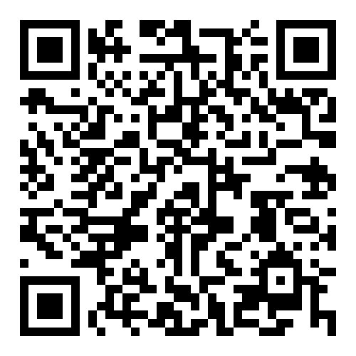

# Politicas de Segurança de Dados

**Base na ISO 27001.**

## ⇶ [Link Trabalho](https://paulopc777.github.io/LGPD-ISO-27001-Politicas-para-Empresas/)

## índice

- [x] A.6.2 Dispositivos movel e Teeltrabalho.[x]

- [x] A.7.1.2 Termos e condiçoes de contratação.
- [x] A.7.2.2 Trinamentos
- [x] A.7.3.1 Enserramento ou mudança na contratação

- [x] A.8.1.1 A tivos

  - Inventatio
  - Porprietario
  - Uso aceitavel
  - Devolução

- [x] A.8.2 Rotulos e tratamento

- [x] A.8.3 Tratamento de midas removiveis

  - Gerenciamento
  - Descarte
  - Transferencia

- [x] A.9.1.1 Politica de controle de acesso Fisico

- [x] A.9.2 Gerenciamento de Usuario

  - registro cancelamento
  - Acesso do usuario
  - Acessos privilegiados
  - Altenticação de Usuario
  -retirada ou ajuste de acesso

- [x]  A.11.1 Suguranca fisica do ambiente

  - Areas seguras
  - Controle de entrada
  -Perimetro
  - tipos para escritorio ,sala instalações
  - Porteção contra ambiental
  - Areas de entraga de carregamento

- [x] A.9.3 Respomsabilidade do Usuario

- [x] A.9.1.2 Acesso a rede servicos de rede

- [x] A.9.4 Acesso a Aplicações de rede

  - restrição a infomação
  - entradano sistema login
  - sistema de senhas

- [x] A.13.1 Segurança de rede

  - Controle da rede
  - Segurança do serviço da rede
  - segregação de rede

- [x] A.11.2 Segurança dos equipamentos

  - Segurança dos cabos
  - Manutenção de equpamentos
  - Remoção dos ativos
  - reutilização ou descarrte
  - equipamentos sem monitoração

- [x] A.12.1 procedimento operacionais

- Separação de desenvolvimento teste e produção

- [x] A.12.2 Poreteção contra malware

- [x] A.12.3 Copias de segurança das infromaçoes

- [x] A.12.3 Registro e monitoramento

  - Regiustro de eventos
  - Porteção de logs
  - logs do administrador e operador
  - Sincronização de relogios

- [x] A.12.5 Controle de softwares operacionais

- [x] A.12.6.2 Restriçoes para instalação de software

- [x] A.12.6.1 Vulnerabilidae Tecnica

